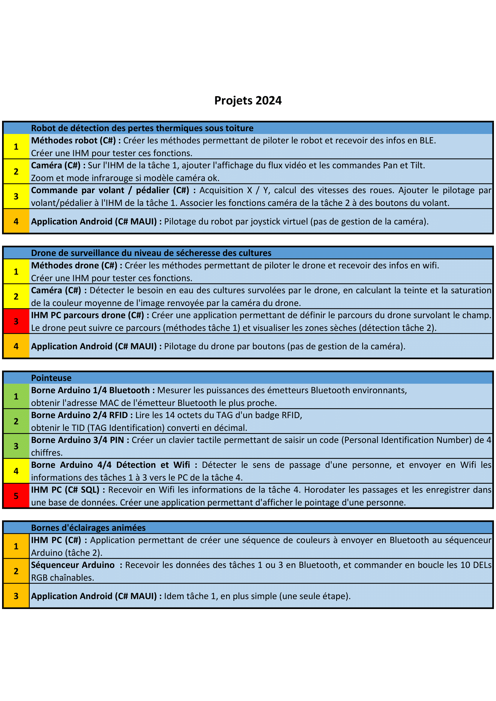

STI2D (Lycée Pierre Mendès France)
=

La STI2D du Lycée Pierre Mendès France est une filière extrèmement particulière. Cependant ce n'est pas identique pour toute les [STI2D](https://tinyurl.com/yc7ftfbj) et cela concerne principalement la STI2D de Pierre Mendes France Vitrolles

## Première STI2D

Liste des Matières

 

### Spécialités

#### I2D

La matière **I2D** en première est un mélange de d'électricité et de mécanique. I2D signifie "Ingénieurie et Dévellopement Durable". Durant les cours on y apprend les bases d'éclectricité, les languages binaires et hexadécimal et le cablâge et les bases de l'électronique. Mais aussi les schémas cinématiques, les trajectoires et les mouvements et les forces et les vecteurs.

#### IT

La matière **IT** en première consiste à appliquer des techniques de conception, programmation, et réalisation. IT signifie "Innovation technologique". Durant les cours on y fait des projets que l'on doit présenter à la fin de l'année qui nous permet de manipuler des logiciel comme SolidWorks ou du programmer en C++ sur des cartes Arduino.

#### Maths Physique-Chimie

Les deux spécialités **Maths Physique-Chimie** sont basées sur les enseignements techniques en approfondissant la mécanique et des sujets mathématiques orientés technique.

### Matières Générales

#### Français

En première STI2D, il y a moins d'heures de **français** qu'en première générale, l'épreuve anticipée du BAC de français se déroule de manière différente avec une épreuve écrite comportant un sujet de contraction et un essai à rediger ou un commentaire de texte avec problématique donnée.

#### ETLV

La matière **ETLV** à lieu une fois par semaine et est géniale. Nous y regardons des vidéos du genre "*Listening, Listening, Listening*". Ou encore "*Learn with your ears, not with your eyes*", mais aussi "*Greenhouse gases*".

#### Autres Matères

Les autres matières ne sont pas bien différentes, cependant il y a moins d'heures que les généraux à causes des spécialitées (I2D, IT, Maths et Physique-Chimie).

## Terminale STI2D

Liste des Matières

### Spécialités

#### 2I2D

La matière **2I2D** en terminale est un mélange de de réseau et de mécanique. 2I2D signifie "Innovation, Ingénieurie et Dévellopement Durable". Durant les cours on y apprend le réseau, les liaisons séries et le cablâge et les bases de l'électronique. Mais aussi la descente de charges, les calculs d'accélération, de vitesse et les lois de la mécanique statique.

#### Option de Spécialités

En première, on doit choisir entre plusieurs options qui consituront 6 heures de notre emplois du temps de terminale, c'est aussi là que nous prépareront notre projet de grand oral du BAC :
- SIN
- ITEC
- EE
- AC

##### SIN

L'option **SIN** est la meilleure de toute, on y fait de l'électronique et de l'informatique. SIN signifie Système d'Information et Numérique

##### ITEC

L'option **ITEC** est la deuxième meilleure de toute, on y fait de la modélisation 3D, des calculs de forces et de vecteurs. ITEC signifie Innovation Technologique et Eco Comception

##### EE

L'option **EE** est la ***PIRE*** de toute, on y fait **RIEN** sauf des entrainements pour le grand oral du bac. EE signifie Énergie et Environnement.

##### AC

L'option **AC** n'est pas disponible au lycée Pierre Mendès France. AC signifie Architecture et Construction.

#### Maths Physique-Chimie

Les deux spécialités **Maths Physique-Chimie** sont basées sur les enseignements techniques en approfondissant la mécanique et des sujets mathématiques orientés technique.

### Matières Générales

#### Philo

En terminale STI2D, il y a moins 2 fois mouins d'heures de **philo** qu'en terminale générale, l'épreuve du BAC de philo se déroule de manière différente avec une épreuve écrite comportant un sujet de contraction et un essai à rediger ou un commentaire de texte avec problématique donnée.

#### Autres Matères

Les autres matières ne sont pas bien différentes, cependant il y a moins d'heures que les généraux à causes des spécialitées (I2D, IT, Maths et Physique-Chimie).

## Les projets en SIN

> _Vous pouvez cliquez sur l'image pour accedez au site fait par Mr Sarcouff et Mr Henoch_

## Les professeurs de STI2D

Nom | Matières | Année
---|:---:|---:
Mr Perez | 2I2D, Spé ITEC | Terminale
Mr Sarcouff | 2I2D, Spé SIN, IT | Terminale
Mr Vigouroux | I2D | Première
Mr Barar | ITEC, IT | Première, Terminale
Mr Houel | ETLV, Spé EE | Première, Terminale
Mr Henoch | Spé SIN | Terminale
Mme Molina | IT, Spé EE, I2D, 2I2D | Premiere Terminale 

Citation de Mr VIGOUROUX
> Vous rigolez parce que j'ai dit BIT,
> Attendez de voir quand je vais vous parlez de l'algèbre de BOOLE

Citation de Mr PEREZ
> Les écoles privées cherche juste a faire de l'argent
> tandis que les école publique cherches a vous instruire
> Je veut pas vous influencez mais y'en a un qui cherche a vous apprendre
